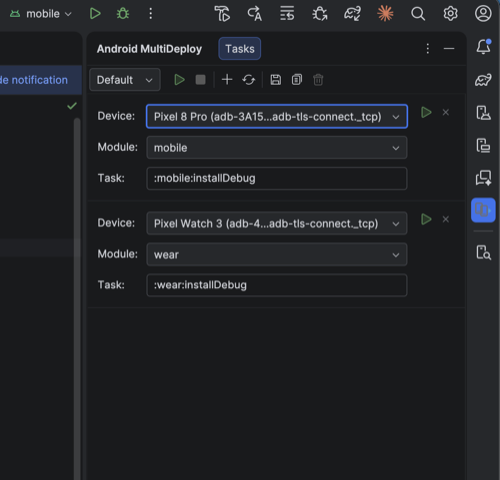

# Android MultiDeploy

An IntelliJ / Android Studio plugin that deploys **multiple modules to multiple devices in a single click**.

Built for multi-device Android development — Wear OS companion apps, automotive + phone combos, multi-form-factor testing — but works for any workflow where you need to push different Gradle targets to different devices simultaneously.



## The problem

Android Studio only lets you deploy one module to one device at a time. If you're building a phone app and a Wear OS app together, you have to switch run configurations, select the right device, hit run, then do it again for the other module. Every. Single. Time.

## The solution

Android MultiDeploy adds a tool window to the right side of your IDE where you define **deployment tasks** — each one maps a **module**, a **Gradle task**, and a **target device**. Hit **Run All** and everything deploys in parallel.

## Features

- **Parallel deployment** — each task runs its own `gradlew` process with `ANDROID_SERIAL` targeting the right device, all at the same time
- **Any Gradle task** — defaults to `:module:installDebug` but fully editable per task (`:app:installRelease`, `:wear:assembleDebug`, custom tasks, etc.)
- **Smart device selection** — when adding a new task, automatically picks a device not already assigned to another task
- **Device health monitoring** — checks every 10 seconds if each task's device is still connected; shows a warning with a retry button if a device goes offline
- **Named configurations** — save different deployment setups (e.g. "Phone + Watch", "Full test suite", "Release build") and switch between them from a dropdown
- **Persistent** — configurations survive IDE restarts (stored in `.idea/multiDeployConfigs.xml`)
- **Error-only output** — successful deploys stay quiet; failed tasks open a console tab with the full Gradle output and show a notification
- **Visual feedback** — running tasks show a spinner and are grayed out; failed tasks get a red border; the toolbar play button animates while deploying

## Installation

1. Build the plugin:
   ```
   ./gradlew buildPlugin
   ```
2. The output zip is at `build/distributions/android-multideploy-1.0.0.zip`
3. In Android Studio: **Settings > Plugins > gear icon > Install Plugin from Disk** > select the zip

### Requirements

- Android Studio or IntelliJ IDEA 2024.3 through 2026.3 (`sinceBuild=243`, `untilBuild=263.*`)
- ADB available via `ANDROID_HOME`, standard SDK paths, or system PATH
- JDK 21 to build the plugin

## Usage

1. Open the **Android MultiDeploy** tool window (right side panel)
2. Click **Add Task** (+) to create a deployment task
3. For each task, select:
   - **Device** — dropdown of connected ADB devices (editable for manual entry)
   - **Module** — auto-discovered from your project's Gradle modules
   - **Task** — pre-filled as `:module:installDebug`, edit as needed
4. Click **Run All** to deploy everything in parallel
5. Click **Stop All** to kill all running deployments

### Configurations

- Use **Save** to persist the current task list to the active configuration
- Use **Save As** to create a new named configuration
- Switch between configurations with the dropdown next to the play button
- The **Default** configuration always exists and cannot be deleted

### Example setup: Wear OS development

| Task | Device | Module | Gradle task |
|------|--------|--------|-------------|
| 1 | Pixel 7 (emulator) | mobile | :mobile:installDebug |
| 2 | Wear OS Round (emulator) | wear | :wear:installDebug |

One click deploys both apps to both devices.

### Other use cases

- **Automotive** — deploy a car app and a phone companion simultaneously
- **Multi-device testing** — push the same app to several phones/tablets at once (duplicate the task, change the device)
- **Mixed build variants** — deploy debug to one device and release to another
- **Custom Gradle tasks** — run any task per device: `assembleDebug`, `connectedAndroidTest`, linting, etc.

## Building from source

```
git clone <repo-url>
cd android-multideploy
./gradlew buildPlugin
```

The plugin is built with:
- Kotlin 1.9.25
- IntelliJ Platform Gradle Plugin 2.2.1
- IntelliJ Platform SDK 2024.3.2
- JDK 21

## License

MIT
